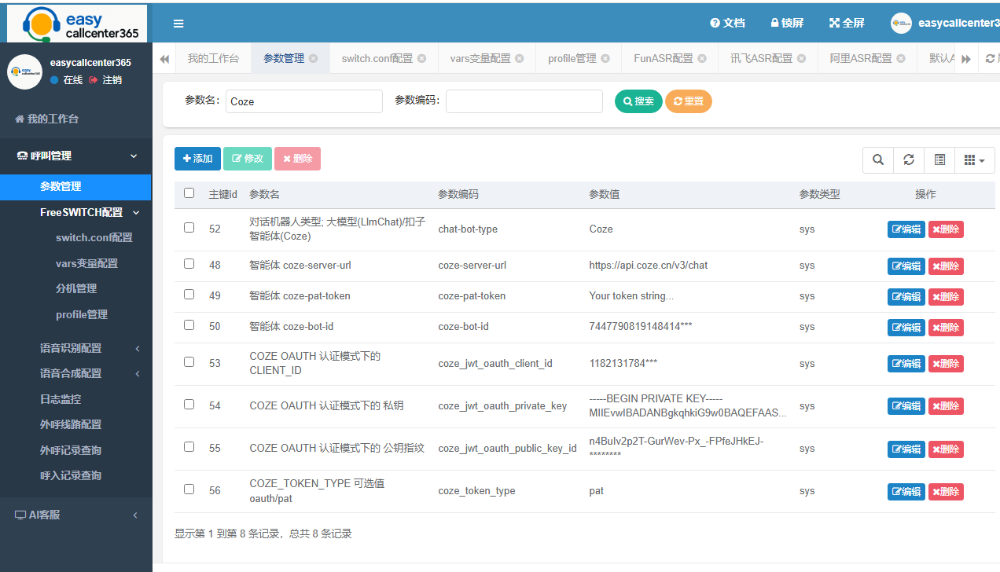
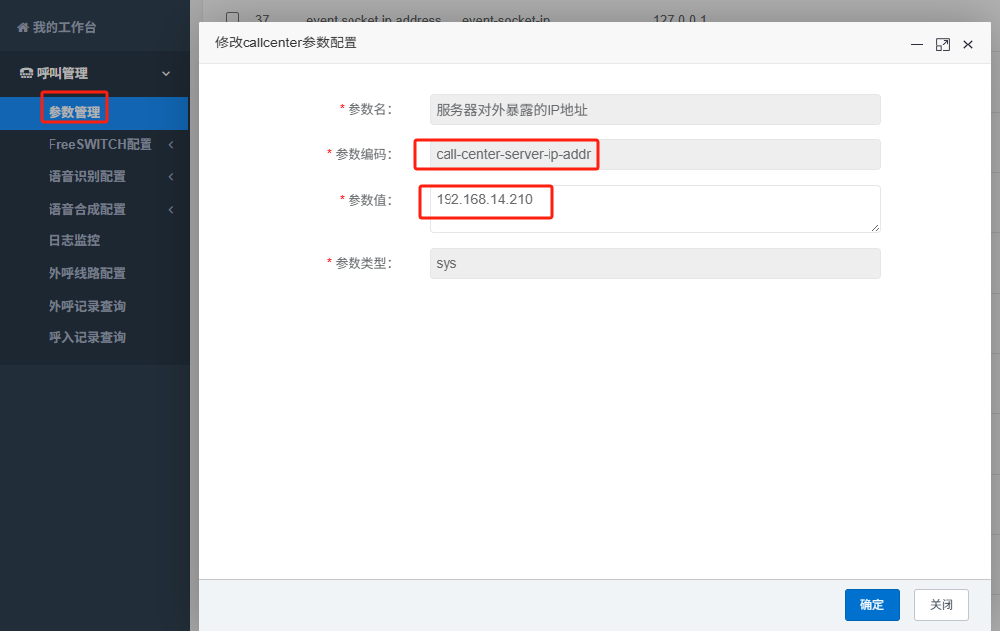
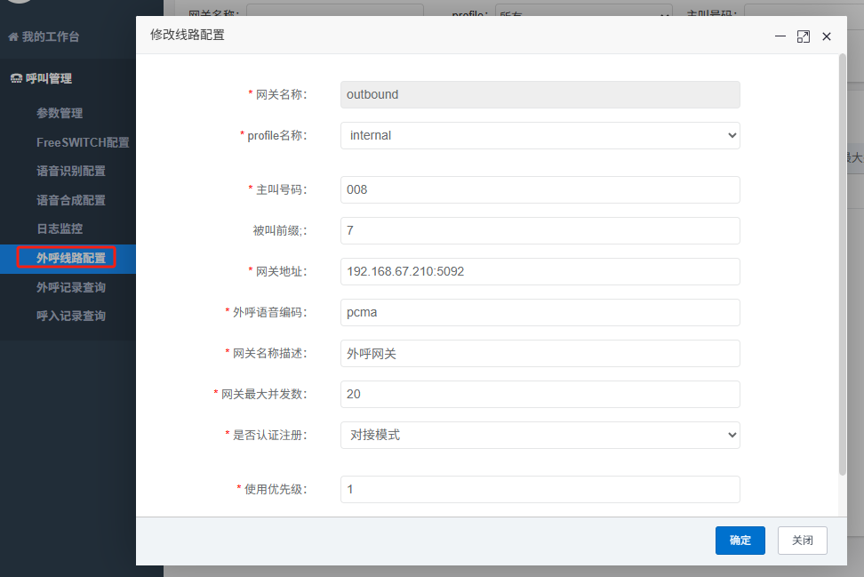
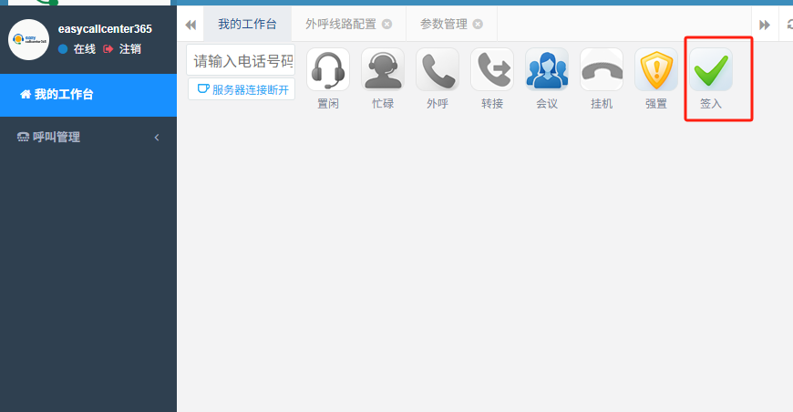

# easycallcenter365


基于FreeSWITCH和大模型的智能电话客服系统。 当前项目是 `easycallcenter365` 的web管理界面。

### 功能列表

* easycallcenter365 的参数在线配置
* 电话工具条
* FreeSWITCH在线配置
* 分机管理
* 日志在线监控
* 语音识别配置
* 语音合成配置
* 通话记录查询

### 系统截图




### 技术交流 && 商业咨询

bug反馈或者咨询问题请在gitee/github上，新建 Issue，并贴上日志。


 

### 编译指南

#### 使用maven导入`freeswitch-esl`库

mvn install:install-file -Dfile=thirdparty\freeswitch-esl-1.3.release.jar -DgroupId=link.thingscloud -DartifactId=freeswitch-esl  -Dversion=1.3.release  -Dpackaging=jar
   
   
#### 设置数据库参数
 
修改 ruoyi-admin\src\main\resources\application-dev.yml, 这里它和 `easycallcenter365` 项目使用的是同一个数据库;

```txt
	url: jdbc:mysql://easycallcenter365:3306/easycallcenter365?useUnicode=true&characterEncoding=utf8&zeroDateTimeBehavior=convertToNull&useSSL=true&serverTimezone=GMT%2B8
	username: root
	password: 123456
```


#### 编译

   执行源代码根目录下的 bin\package.bat 脚本，编译完成后，jar包位于 ruoyi-admin\target 目录下，名字是 easycallcenter365-gui.jar 。
   
#### 部署

部署参考： https://github.com/easycallcenter365/easycallcenter365/blob/master/Deploy.txt  

#### 人工坐席的外呼配置

easycallcenter365-gui系统提供了基于电话工具条的人工坐席外呼功能，详细配置如下。

* 配置电话工具条的IP地址参数

找到后台的参数管理，修改参数： call-center-server-ip-addr ，改为当前服务器的对外IP地址。

 

* 外呼线路配置

此外，还需要在后台 外呼线路配置 ，添加相关外呼外线路。

 

* 坐席登录上线

做好以上设置之后，退出并重新登录后台，在我的工作台，点击签入即可。

 


   
   
   